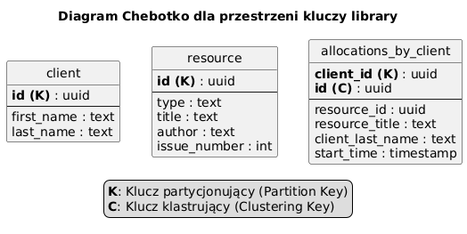

## Przestrzeń kluczy: `library`

### Tabela: `client`

| Kolumna     | Typ  | Klucz |
|-------------|------|-------|
| id          | uuid | K     |
| first\_name | text |       |
| last\_name  | text |       |

### Tabela: `resource`

| Kolumna       | Typ  | Klucz |
|---------------|------|-------|
| id            | uuid | K     |
| type          | text |       |
| title         | text |       |
| author        | text |       |
| issue\_number | int  |       |

### Tabela: `allocations_by_client`

| Kolumna            | Typ       | Klucz |
|--------------------|-----------|-------|
| client\_id         | uuid      | K     |
| id                 | uuid      | C     |
| resource\_id       | uuid      |       |
| resource\_title    | text      |       |
| client\_last\_name | text      |       |
| start\_time        | timestamp |       |

---

* K: Klucz partycjonujący (Partition Key)
* C: Klucz klastrujący (Clustering Key)